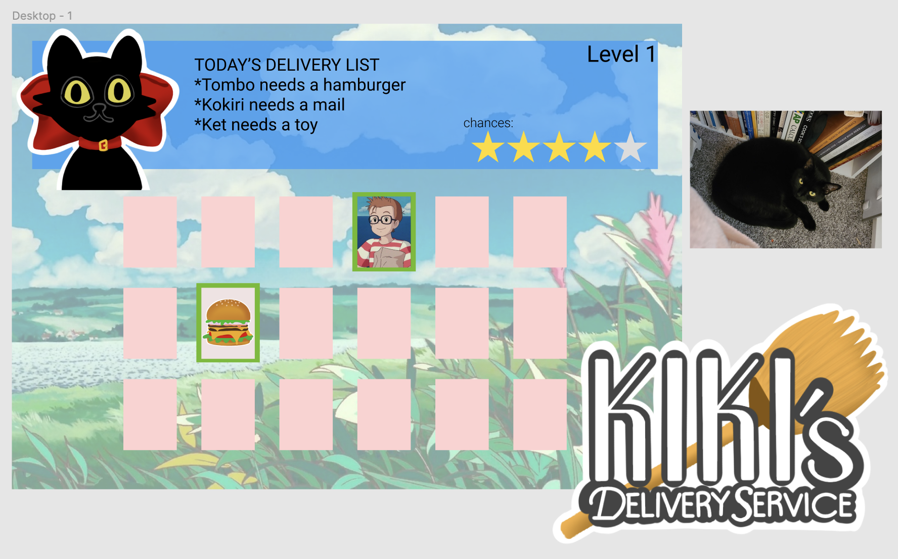
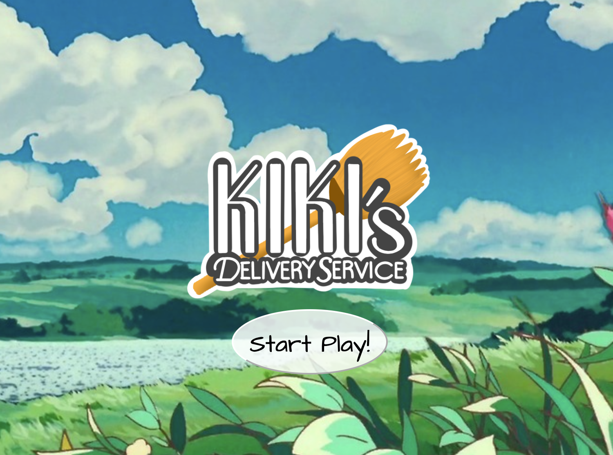
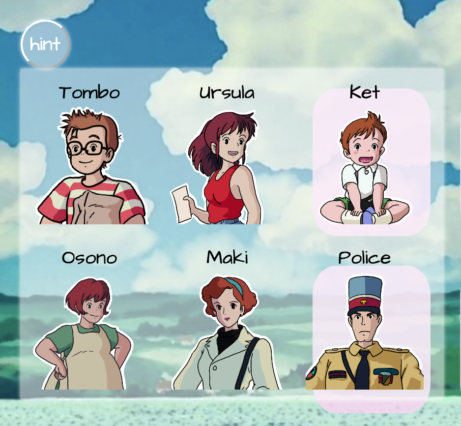
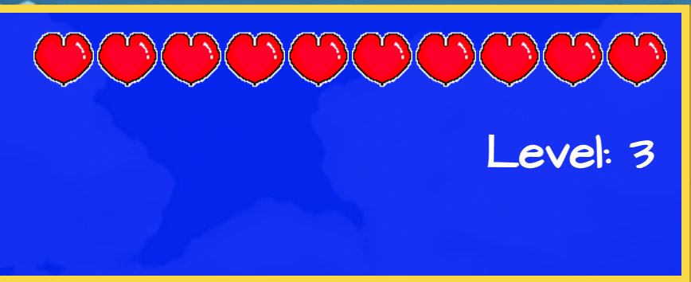

# Kiki's Delivery Service
===============================================================
### Welcome everyone!
**Kiki's Delivery Service** game has similar concept of Memory Matching game, which requires the player to find two cards that are related to each other. The theme of the game is based on _**Studio Ghibli**_'s animation movie called _**Kiki's Delivery Service**_. 

link to the game is [here](https://bosunkim92.github.io/kikis-delivery-game)

Wireframe:

Pseudocode:
Starting with the bare minimum - HTML landing page with a start button;
Once player clicks on to the 'Start Play', JavaScript code will dynamically build the game features on to the page.
This function uses _**Fisher-Yates**_ suffle algorithm.

General outline of the game is like this -
* Goal of the game, delivery list, is generated randomly by the computer
* Cards that contains images of the people and the items are suffled on to the game board area.
* Player can choose a card by clicking the card.
* Once player selects two cards, it triggers a function that compares player's selection with the target goal.
* If the selection is correct, the the cards will display green box-shadow.
* If the selection is  incorrect, then two cards that has been selected will hide its image again.
* Player can make move until the life (heart) reaches 0. 
* If player founds all three target goal, then it levels up and game refreshes.

Event Listeners will response to player's click on the card, and it will save player's selection as an array.
Success match function will iterate through target list array and check if any of that target list contains player's selection. 
As all 3 goals met as the winning condition, level up function gets invoked and new game set begins. 

**Technologies Used:** _HTML, CSS, and JavaScript_

**How To Play:**

As the game starts, 

player will see total of 18 cards facing backward.
These cards contains total of 6 characters and 12 items, and 3 sets of a person and an item will be choosen as delivery target.
Oh, you haven't watched the movie and don't know the characters of the movie? Don't worry, I got you a little hint button for you!

The goal is to memorize the card location as you flip the card, and eventually match all 3 target delivery lists.

You can disregard the order of the lists, as long as you are deliverying the correct item to the right person!
If you mismatch the set, those cards will be turned to its back again, and each time you make mistake, your life will be decreased by one. 
Once your try reaches 0, your game is over, and you can click 'Replay' button to start the game again.

Let's see if you can make it to next level!

